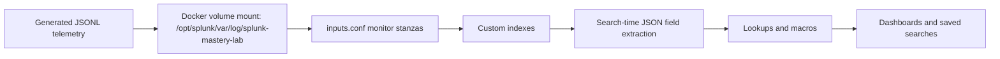

# Architecture

## Lab Topology

## Splunk App Components

| File | Purpose |
| --- | --- |
| `default/app.conf` | App metadata and label |
| `default/indexes.conf` | Dedicated indexes for auth, web, endpoint, cloud, and network data |
| `default/inputs.conf` | Monitor inputs for generated JSONL files |
| `default/props.conf` | JSON sourcetype parsing and timestamp extraction |
| `default/transforms.conf` | Lookup definitions |
| `default/macros.conf` | Reusable SPL bases for dashboards and detections |
| `default/savedsearches.conf` | Scheduled analytic searches |
| `default/data/ui/views/*.xml` | Simple XML dashboards |
| `lookups/*.csv` | Asset and identity enrichment |

## Index and Sourcetype Model

| Index | Sourcetype | Data Domain |
| --- | --- | --- |
| `lab_auth` | `splunk_lab:auth:json` | Identity provider, VPN, cloud console, SaaS authentication |
| `lab_web` | `splunk_lab:web:json` | HTTP, API, performance, and attack telemetry |
| `lab_endpoint` | `splunk_lab:endpoint:json` | Process, file, registry, and endpoint network events |
| `lab_cloud` | `splunk_lab:cloudtrail:json` | AWS-style CloudTrail management events |
| `lab_network` | `splunk_lab:network:json` | Network flow and security device telemetry |

## Design Choices

- JSONL keeps the lab easy to regenerate, diff, and review in Git.
- Separate indexes demonstrate Splunk administration basics and make SPL more realistic.
- Search-time JSON extraction is sufficient for a lightweight lab and avoids brittle custom transforms.
- Lookups are intentionally small but demonstrate enrichment patterns used in production SOCs.
- Simple XML dashboards maximize portability across Splunk Enterprise and Splunk Free lab environments.

## Demo Flow

1. Start with the SOC Overview to show cross-domain visibility.
2. Pivot to Auth and Identity Threats for brute force, spray, and impossible travel.
3. Open Web and API Security for application attack and performance analytics.
4. Open Endpoint Detection to connect user activity to process execution and egress.
5. Open Cloud Security to show AWS-style privilege escalation analytics.
6. Finish with `docs/SPL_PLAYBOOK.md` to explain the SPL patterns behind the dashboards.
