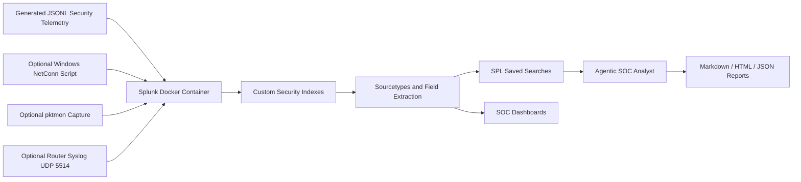

Splunk Security Operations Lab with Agentic Threat Triage

This project is built like a real Splunk app, not a loose collection of saved searches. It includes Dockerized Splunk, custom indexes, JSON sourcetypes, lookup enrichment, saved searches, Simple XML dashboards, realistic generated telemetry, live capture helpers, and a read-only agentic SOC analyst.
Repository Description
Dockerized Splunk SOC lab with custom indexes, realistic security telemetry, dashboards, SPL detections, and an agentic analyst that triages threats and generates investigation reports.
What This Demonstrates
Splunk Enterprise deployment with Docker Compose
Custom Splunk app structure and configuration
Data onboarding into dedicated security indexes
JSON sourcetype design and field extraction
SPL detection engineering across identity, endpoint, web, cloud, and network telemetry
Dashboard design for SOC workflows
Read-only agentic triage automation
Markdown, HTML, and JSON investigation reporting
Responsible optional home-network telemetry capture
Proof Screenshots
Splunk Runtime

Indexed Data

Dashboard Coverage

Agentic SOC Analyst

SPL Detection Coverage

Architecture

Core Features
Area	What Was Built
Splunk Platform	Dockerized Splunk Enterprise lab with repeatable startup and install scripts
Splunk App	Custom app containing indexes, inputs, props, transforms, macros, saved searches, dashboards, navigation, and lookups
Data Engineering	Generated JSONL telemetry across authentication, web/API, endpoint, cloud, and network domains
Detection Engineering	SPL searches for brute force, password spray, impossible travel, LOLBins, egress, cloud escalation, risky clients, and beaconing
Dashboarding	Five SOC-focused dashboards for triage and investigation
Agentic Triage	Read-only Python analyst agent that runs detections, ranks findings, summarizes evidence, and writes reports
Documentation	Full user guide, architecture notes, SPL playbook, agent notes, and proof screenshots

Custom Indexes
Index	Telemetry Domain	Example Use Cases
lab_auth	Authentication and identity	Brute force, password spray, impossible travel, MFA failures
lab_web	Web and API activity	SQL injection, suspicious clients, API errors, response-time anomalies
lab_endpoint	Endpoint and process events	Encoded PowerShell, LOLBins, process chains, endpoint egress
lab_cloud	CloudTrail-style cloud events	IAM escalation, policy attachment, access key creation, API failures
lab_network	Network flow events	Beaconing, suspicious destinations, high-risk ports, connection patterns

Dashboards
The Splunk app includes five prebuilt dashboards:
SOC Overview: signal volume, high-severity events, affected users, and prioritized investigation queue
Auth and Identity Threats: authentication outcomes, brute force candidates, password spray candidates, and impossible travel
Web and API Security: HTTP health, attack distribution, risky clients, and response-time trends
Endpoint Detection: suspicious process execution, living-off-the-land chains, and endpoint egress
Cloud Security: CloudTrail activity, API errors, privilege escalation, and unusual source countries
Dashboard files are stored in:
splunk/etc/apps/splunk_mastery_lab/default/data/ui/views/
Attack Storylines
The sample telemetry includes normal operational activity plus deliberate security storylines:
Password spray and brute force attempts against carla.ruiz
Impossible travel behavior for erin.patel
SQL injection activity against payments-api
Encoded PowerShell launched from winword.exe
Suspicious endpoint egress to port 4444
AWS-style privilege escalation ending with policy attachment
Network beacon candidates based on repeated connection behavior
Quick Start
Requirements:
Docker Desktop
Python 3
Splunk Docker image access
PowerShell for the Windows helper scripts
Start Splunk:
docker compose up -d
Install the Splunk app and load sample data:
.\scripts\Install-LabIntoContainer.ps1
Open Splunk Web:
http://localhost:8000
Default login:
username: admin
password: SplunkLab!2026
Validate the Lab
Check the container:
docker compose ps
Validate Splunk Web:
Invoke-WebRequest -UseBasicParsing -Uri "http://localhost:8000" -TimeoutSec 8
Validate indexed data:
docker exec splunk-mastery-lab sudo -u splunk /opt/splunk/bin/splunk search "index=lab_auth OR index=lab_web OR index=lab_endpoint OR index=lab_cloud OR index=lab_network | stats count by index" -earliest_time 0 -latest_time now -auth admin:SplunkLab!2026 -output csv
Useful SPL:
index=lab_auth OR index=lab_web OR index=lab_endpoint OR index=lab_cloud OR index=lab_network
| stats count min(_time) as first_seen max(_time) as last_seen by index sourcetype
| convert ctime(first_seen) ctime(last_seen)
Agentic SOC Analyst
The agent is defensive and read-only. It queries Splunk through the management API, runs curated SPL detections, ranks findings, summarizes the evidence, and writes reports.
Run the full triage:
python -m agent.run_triage --mode all --earliest -24h --latest now --report reports\latest_triage.md --html-report reports\latest_triage.html --json-output reports\latest_triage.json
Or use the launcher:
.\scripts\Run-AgentDashboard.ps1
Focused modes:
python -m agent.run_triage --mode identity --earliest -7d
python -m agent.run_triage --mode endpoint --earliest -24h
python -m agent.run_triage --mode cloud --earliest -7d
python -m agent.run_triage --mode web --earliest -24h
python -m agent.run_triage --mode network --earliest -24h
The agent does not kill processes, block IPs, quarantine files, modify endpoints, or make destructive changes.
Detection Coverage
Detection	What It Looks For
Identity brute force	Repeated authentication failures against a user or from a source
Password spray	One source attempting many usernames
Impossible travel	Same user authenticating from geographically unlikely locations
LOLBin process execution	Suspicious use of tools such as PowerShell, wscript, or encoded commands
Endpoint egress	Endpoint traffic to unusual ports or suspicious remote destinations
Cloud privilege escalation	IAM-style policy changes, access key creation, or privilege grants
Risky web/API clients	Suspicious HTTP status patterns, attack indicators, and client behavior
Network beacon candidates	Repeated connection patterns with consistent timing or destination behavior

Script Catalog
Script	Purpose
scripts/generate_data.py	Generates JSONL telemetry for all five domains
scripts/Install-LabIntoContainer.ps1	Copies app and data into Splunk, restarts the container, and loads sample events
scripts/Run-AgentDashboard.ps1	Runs the triage agent and opens the HTML report
scripts/Watch-NetConnections.ps1	Captures local Windows TCP connection telemetry into JSONL
scripts/Start-PktmonCapture.ps1	Starts a Windows pktmon packet capture for optional packet analysis
agent/run_triage.py	Agent CLI entry point for all detection modes
agent/detections.py	Curated SPL detection library used by the agent
agent/splunk_client.py	Splunk REST client for search jobs and API connectivity
agent/report_writer.py	Writes Markdown, HTML, and JSON triage reports

Repository Layout
.
|-- agent/
|-- data/
|-- docs/
|-- reports/
|-- screenshots/
|-- scripts/
|-- splunk/etc/apps/splunk_mastery_lab/
|-- docker-compose.yml
|-- Makefile
`-- README.md
Recommended Demo Flow
Start Docker Desktop and run docker compose up -d.
Run .\scripts\Install-LabIntoContainer.ps1.
Open Splunk Web at http://localhost:8000.
Show the SOC Overview dashboard.
Pivot to identity, endpoint, web/API, and cloud dashboards.
Run the five-index validation SPL search.
Run .\scripts\Run-AgentDashboard.ps1.
Open the HTML report and walk through the prioritized findings.
Explain that the agent is read-only and human-in-the-loop.
Close with the screenshots, detection playbook, and architecture documentation.
Security and Ethics
This lab is for defensive learning and portfolio demonstration. The included capture scripts should only be used on personal lab systems, owned devices, or networks where explicit permission has been granted. The agent is intentionally read-only and does not perform containment actions.
Best Repository Topics
splunk soc cybersecurity siem threat-detection incident-response spl security-analytics docker python agentic-ai
