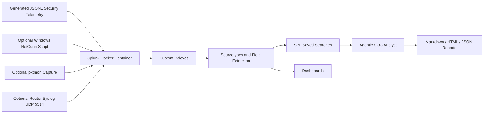

# Splunk SOC Mastery Lab with Agentic Threat Triage

Portfolio-grade Splunk Enterprise SOC lab demonstrating data onboarding, custom app engineering, SPL detection logic, operational dashboards, optional home-network telemetry, and a defensive agentic analyst that triages suspicious activity and writes investigation reports.

This project is built like a real Splunk app, not a loose collection of searches. It includes Dockerized Splunk, custom indexes, JSON sourcetypes, lookup enrichment, saved searches, Simple XML dashboards, generated security telemetry, live Windows/network capture helpers, and a read-only agentic SOC analyst.

## Recruiter Summary

This lab demonstrates practical Splunk and SOC engineering skills:

- Built a Dockerized Splunk Enterprise lab with repeatable deployment scripts.
- Created five custom security indexes for authentication, web/API, endpoint, cloud, and network telemetry.
- Designed realistic JSONL telemetry with normal activity plus attack storylines.
- Authored SPL detections for brute force, password spray, impossible travel, web attacks, suspicious PowerShell, endpoint egress, cloud privilege escalation, and beaconing behavior.
- Built five dashboards for SOC overview, identity, web/API, endpoint, and cloud investigations.
- Added an agentic SOC analyst that queries Splunk, prioritizes findings, explains likely risk, and produces Markdown, HTML, and JSON reports.
- Included optional scripts for Windows connection telemetry, `pktmon` packet capture, and router/syslog-style ingestion.

## Proof Screenshots

### Splunk Runtime


### Indexed Data


### Dashboard Coverage


### Agentic SOC Analyst


### SPL Detection Coverage


### Documentation Package


## Architecture



## Lab Components

| Component | Purpose |
| --- | --- |
| `docker-compose.yml` | Runs Splunk Enterprise locally with Splunk Web, HEC, management API, and UDP syslog ports. |
| `splunk/etc/apps/splunk_mastery_lab/` | Custom Splunk app with indexes, sourcetypes, macros, saved searches, dashboards, navigation, and lookups. |
| `data/*.jsonl` | Generated security telemetry used to populate the lab. |
| `scripts/generate_data.py` | Creates realistic sample data with deliberate incident storylines. |
| `scripts/Install-LabIntoContainer.ps1` | Copies the app and data into the running Splunk container, restarts Splunk, and loads sample data. |
| `agent/` | Read-only defensive analyst agent that runs curated detections and writes reports. |
| `reports/` | Output folder for generated triage reports. |
| `docs/` | Architecture, SPL playbook, home-network capture, and agent documentation. |
| `screenshots/` | GitHub-ready proof images for the README. |

## Custom Indexes

| Index | Telemetry Domain | Example Use Cases |
| --- | --- | --- |
| `lab_auth` | Authentication and identity | Brute force, password spray, impossible travel, MFA failures |
| `lab_web` | Web and API activity | SQL injection, suspicious clients, API errors, response-time anomalies |
| `lab_endpoint` | Process and endpoint events | Encoded PowerShell, LOLBins, parent-child process chains, egress |
| `lab_cloud` | CloudTrail-style cloud events | Privilege escalation, policy attachment, unusual countries, API failures |
| `lab_network` | Network flow events | Beaconing, suspicious destinations, high-risk ports, connection patterns |

## Dashboards

The Splunk app includes five prebuilt dashboards:

- **SOC Overview**: signal volume, high-severity events, affected users, and prioritized investigation queue.
- **Auth and Identity Threats**: authentication outcomes, brute force candidates, password spray candidates, and impossible travel.
- **Web and API Security**: HTTP health, attack distribution, risky clients, and response-time trends.
- **Endpoint Detection**: suspicious process execution, living-off-the-land chains, and endpoint egress.
- **Cloud Security**: CloudTrail activity, API errors, privilege escalation, and unusual source countries.

Dashboard files live in:

```text
splunk/etc/apps/splunk_mastery_lab/default/data/ui/views/
```

## Data Storylines

The generated telemetry includes normal operational noise plus deliberate security storylines:

- Password spray and brute force attempts against `carla.ruiz`.
- Impossible travel behavior for `erin.patel`.
- SQL injection activity against `payments-api`.
- Encoded PowerShell launched from `winword.exe`.
- Suspicious endpoint egress to port `4444`.
- AWS-style privilege escalation ending with policy attachment.
- Network beacon candidates for repeated low-volume callback behavior.

## Quick Start

Requirements:

- Windows, macOS, or Linux
- Docker Desktop
- Python 3
- Splunk Docker image access

Start the lab:

```powershell
cd splunk-mastery-lab
docker compose up -d
.\scripts\Install-LabIntoContainer.ps1
```

Open Splunk Web:

```text
http://localhost:8000
```

Default login:

```text
username: admin
password: SplunkLab!2026
```

Open the **Splunk Mastery Lab** app and review the dashboards.

## Validate the Lab

Check Docker:

```powershell
docker compose ps
```

Check Splunk Web:

```powershell
Invoke-WebRequest -UseBasicParsing -Uri "http://localhost:8000" -TimeoutSec 8
```

Validate indexed data:

```powershell
docker exec splunk-mastery-lab sudo -u splunk /opt/splunk/bin/splunk search "index=lab_auth OR index=lab_web OR index=lab_endpoint OR index=lab_cloud OR index=lab_network | stats count by index" -earliest_time 0 -latest_time now -auth admin:SplunkLab!2026 -output csv
```

Useful Splunk search:

```spl
index=lab_auth OR index=lab_web OR index=lab_endpoint OR index=lab_cloud OR index=lab_network
| stats count min(_time) as first_seen max(_time) as last_seen by index sourcetype
| convert ctime(first_seen) ctime(last_seen)
```

## Run the Agentic SOC Analyst

The agent is defensive and read-only. It queries Splunk through the management API, runs curated SPL detections, ranks findings, summarizes the evidence, and writes reports.

Run the full triage:

```powershell
python -m agent.run_triage --mode all --earliest -24h --latest now --report reports\latest_triage.md --html-report reports\latest_triage.html --json-output reports\latest_triage.json
```

Or use the launcher:

```powershell
.\scripts\Run-AgentDashboard.ps1
```

Focused modes:

```powershell
python -m agent.run_triage --mode identity --earliest -7d
python -m agent.run_triage --mode endpoint --earliest -24h
python -m agent.run_triage --mode cloud --earliest -7d
python -m agent.run_triage --mode web --earliest -24h
python -m agent.run_triage --mode network --earliest -24h
```

Agent environment variables:

```powershell
$env:SPLUNK_HOST="localhost"
$env:SPLUNK_PORT="8089"
$env:SPLUNK_USERNAME="admin"
$env:SPLUNK_PASSWORD="SplunkLab!2026"
```

The agent does **not** kill processes, block IPs, quarantine files, modify endpoints, or make destructive changes.

## Agent Detection Coverage

| Detection | What It Looks For |
| --- | --- |
| Identity brute force | Repeated authentication failures against a user or from a source. |
| Password spray | One source attempting many usernames. |
| Impossible travel | Same user authenticating from geographically unlikely locations. |
| LOLBin process execution | Suspicious use of tools such as PowerShell, `wscript`, or encoded commands. |
| Endpoint egress | Endpoint traffic to unusual ports or suspicious remote destinations. |
| Cloud privilege escalation | IAM-style policy changes, access key creation, or privilege grants. |
| Risky web/API clients | Suspicious HTTP status patterns, attack indicators, and client behavior. |
| Network beacon candidates | Repeated connection patterns with consistent timing or destination behavior. |

## Script Catalog

| Script | Process | How to Run |
| --- | --- | --- |
| `scripts/generate_data.py` | Generates JSONL telemetry for all five domains. | `python scripts/generate_data.py --days 14 --events-per-day 1300` |
| `scripts/Install-LabIntoContainer.ps1` | Copies app and data into Splunk, restarts the container, and loads oneshot data. | `.\scripts\Install-LabIntoContainer.ps1` |
| `scripts/Run-AgentDashboard.ps1` | Runs the triage agent and opens the HTML report. | `.\scripts\Run-AgentDashboard.ps1` |
| `scripts/Watch-NetConnections.ps1` | Captures local Windows TCP connection telemetry into JSONL. | `.\scripts\Watch-NetConnections.ps1 -Seconds 300 -IntervalSeconds 5` |
| `scripts/Start-PktmonCapture.ps1` | Starts a Windows `pktmon` packet capture for optional packet analysis. | `.\scripts\Start-PktmonCapture.ps1` |
| `agent/run_triage.py` | Agent CLI entry point for all detection modes. | `python -m agent.run_triage --mode all --earliest -24h` |
| `agent/detections.py` | Curated SPL detection library used by the agent. | Imported by `agent/run_triage.py`. |
| `agent/splunk_client.py` | Minimal Splunk REST client for search jobs and API connectivity. | Imported by the agent. |
| `agent/report_writer.py` | Writes Markdown, HTML, and JSON triage reports. | Imported by the agent. |

## Key Script Excerpts

Install the lab into Splunk:

```powershell
docker cp "$appPath" "${ContainerName}:/opt/splunk/etc/apps/"
docker cp "$dataPath\." "${ContainerName}:/opt/splunk/var/log/splunk-mastery-lab/"
docker restart $ContainerName
docker exec -u splunk $ContainerName /opt/splunk/bin/splunk add oneshot $item.Path -index $item.Index -sourcetype $item.Sourcetype -auth admin:SplunkLab!2026
```

Run the agent and write all report formats:

```powershell
python -m agent.run_triage --mode $Mode --earliest $Earliest --latest $Latest --report $md --html-report $html --json-output $json
```

Capture Windows connection telemetry:

```powershell
Get-NetTCPConnection | Where-Object {
    $_.State -in @("Established", "SynSent", "Listen", "TimeWait")
}
```

## Home-Network Telemetry

Optional live telemetry features are included for controlled lab use:

- Windows TCP connection snapshots with owning process names.
- Windows `pktmon` capture helper.
- UDP syslog listener on port `5514` for router or firewall-style logs.

See:

```text
docs/HOME_NETWORK_CAPTURE.md
```

Use these features only on networks and devices you own or have permission to monitor.

## Repository Layout

```text
.
|-- agent/
|   |-- analyst_agent.py
|   |-- detections.py
|   |-- report_writer.py
|   |-- run_triage.py
|   `-- splunk_client.py
|-- data/
|   |-- auth_events.jsonl
|   |-- cloudtrail_events.jsonl
|   |-- endpoint_events.jsonl
|   |-- network_events.jsonl
|   `-- web_events.jsonl
|-- docs/
|   |-- AGENTIC_SOC_ANALYST.md
|   |-- ARCHITECTURE.md
|   |-- HOME_NETWORK_CAPTURE.md
|   |-- SPL_PLAYBOOK.md
|   `-- Splunk_Mastery_Lab_User_Guide.pdf
|-- screenshots/
|-- scripts/
|-- splunk/etc/apps/splunk_mastery_lab/
|-- docker-compose.yml
|-- Makefile
`-- README.md
```

## Recommended Demo Flow

1. Start Docker Desktop and run `docker compose up -d`.
2. Run `.\scripts\Install-LabIntoContainer.ps1`.
3. Open Splunk Web at `http://localhost:8000`.
4. Show the **SOC Overview** dashboard.
5. Pivot to identity, endpoint, web/API, and cloud dashboards.
6. Run the validation SPL search to prove all five indexes contain data.
7. Run `.\scripts\Run-AgentDashboard.ps1`.
8. Open the HTML report and walk through the prioritized findings.
9. Explain that the agent is read-only and human-in-the-loop.
10. Close with the GitHub docs, screenshots, and detection playbook.

## Security and Ethics

This lab is for defensive learning and portfolio demonstration. The included capture scripts should only be used on your own PC, lab systems, or networks where you have explicit permission. The agent is intentionally read-only and does not perform containment actions.

## License Note

The official Splunk Docker image requires license acceptance. This lab pins the image to:

```yaml
splunk/splunk:9.4.2
```

The compose file includes:

```yaml
SPLUNK_START_ARGS: --accept-license
SPLUNK_GENERAL_TERMS: --accept-sgt-current-at-splunk-com
```

Splunk Enterprise trial behavior is useful for this lab because it preserves authentication, API access, and app administration while validating the project.
