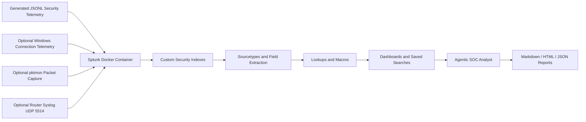

# Splunk Security Operations Agentic Threat Detection

This document consolidates the supporting project documentation for the Splunk SOC Mastery Lab with Agentic Threat Triage. It is intended as the main companion document after the repository README.

## Executive Overview

This lab demonstrates a full defensive security operations workflow using Splunk Enterprise, realistic generated telemetry, custom dashboards, SPL detections, and a read-only agentic SOC analyst.

The project shows how security data moves from raw telemetry into Splunk indexes, how SPL detections identify suspicious behavior, how dashboards support analyst triage, and how an agentic workflow can summarize findings into investigation reports without taking destructive action.

## Lab Objectives

- Build a repeatable local Splunk Enterprise lab using Docker.
- Create a real Splunk app structure with custom configuration.
- Ingest realistic authentication, web/API, endpoint, cloud, and network telemetry.
- Build dashboards that support SOC analyst investigation workflows.
- Write practical SPL detections for common security scenarios.
- Add a read-only agentic analyst that runs detections and produces reports.
- Include optional live telemetry collection for owned Windows systems and authorized networks.

## Architecture



## Splunk App Components

| File or Folder | Purpose |
| --- | --- |
| `default/app.conf` | Splunk app metadata and label |
| `default/indexes.conf` | Dedicated indexes for authentication, web/API, endpoint, cloud, and network data |
| `default/inputs.conf` | Inputs for generated data, live Windows connection telemetry, and UDP syslog-style logs |
| `default/props.conf` | JSON sourcetype parsing and timestamp extraction |
| `default/transforms.conf` | Lookup definitions |
| `default/macros.conf` | Reusable SPL bases for dashboards and detections |
| `default/savedsearches.conf` | Scheduled analytic searches |
| `default/data/ui/views/*.xml` | Simple XML dashboards |
| `lookups/*.csv` | Asset and identity enrichment |

## Index and Sourcetype Model

| Index | Sourcetype | Data Domain |
| --- | --- | --- |
| `lab_auth` | `splunk_lab:auth:json` | Identity provider, VPN, cloud console, and SaaS authentication |
| `lab_web` | `splunk_lab:web:json` | HTTP, API, performance, and web attack telemetry |
| `lab_endpoint` | `splunk_lab:endpoint:json` | Process, file, registry, and endpoint network events |
| `lab_cloud` | `splunk_lab:cloudtrail:json` | AWS-style CloudTrail management events |
| `lab_network` | `splunk_lab:network:json` | Network flow and security device telemetry |
| `lab_network` | `splunk_lab:windows_netconn:json` | Optional live Windows connection telemetry |
| `lab_network` | `splunk_lab:router:syslog` | Optional router or firewall syslog-style events |

## Design Choices

- JSONL telemetry keeps the lab easy to regenerate, review, and commit to Git.
- Separate indexes demonstrate Splunk administration basics and make the SPL more realistic.
- Search-time JSON extraction keeps the lab portable and lightweight.
- Lookups demonstrate asset and identity enrichment patterns used in production SOCs.
- Simple XML dashboards maximize portability across Splunk Enterprise lab environments.
- The agentic analyst is read-only to preserve a safe human-in-the-loop workflow.

## Dashboard Coverage

The lab includes five Splunk dashboards:

| Dashboard | Purpose |
| --- | --- |
| SOC Overview | Cross-domain signal volume, high-severity events, affected users, and prioritized investigation queue |
| Auth and Identity Threats | Authentication outcomes, brute force, password spray, and impossible travel |
| Web and API Security | HTTP health, attack distribution, risky clients, and response-time trends |
| Endpoint Detection | Suspicious process execution, living-off-the-land chains, and endpoint egress |
| Cloud Security | CloudTrail activity, API errors, privilege escalation, and unusual source countries |

## Attack Storylines

The generated telemetry includes normal operational noise plus deliberate security storylines:

- Password spray and brute force attempts against `carla.ruiz`.
- Impossible travel behavior for `erin.patel`.
- SQL injection activity against `payments-api`.
- Encoded PowerShell launched from `winword.exe`.
- Suspicious endpoint egress to port `4444`.
- AWS-style privilege escalation ending with policy attachment.
- Network beacon candidates based on repeated callback behavior.

## SPL Playbook

### Data Health

```spl
| tstats count where index IN (lab_auth, lab_web, lab_endpoint, lab_cloud, lab_network) by index sourcetype
```

This provides fast metadata-level validation using `tstats`.

```spl
index=lab_auth OR index=lab_web OR index=lab_endpoint OR index=lab_cloud OR index=lab_network
| stats count min(_time) as first_seen max(_time) as last_seen by index sourcetype
| convert ctime(first_seen) ctime(last_seen)
```

This confirms timestamp parsing and source coverage.

### SOC Prioritization

```spl
`lab_indexes` severity IN ("critical","high")
| eval entity=coalesce(user,host,src_ip,src,client_ip)
| eval technique=coalesce(attack_type,eventName,process_name,signature,action)
| stats count as events values(index) as indexes values(technique) as techniques max(risk_score) as max_risk latest(_time) as last_seen by entity severity
| eval priority=case(severity="critical",100,severity="high",75,true(),25)+coalesce(max_risk,0)+events
| sort - priority
| convert ctime(last_seen)
```

This demonstrates cross-domain normalization and risk-based triage.

### Brute Force and Password Spray

```spl
`failed_auth_base`
| bucket _time span=30m
| stats count as failures dc(src_ip) as src_count values(src_ip) as src_ips values(reason) as reasons min(_time) as first_seen max(_time) as last_seen by user _time
| lookup identity_risk user OUTPUT department privileged vip risk_score
| eval spray_indicator=if(src_count>=5 AND failures>=10,"possible spray","focused brute force")
| eval priority=failures+coalesce(risk_score,0)+if(privileged="true",30,0)+if(vip="true",40,0)
| where failures>=6
| sort - priority
| convert ctime(first_seen) ctime(last_seen)
```

This uses time bucketing, distinct-count source logic, identity enrichment, and risk scoring.

### Impossible Travel

```spl
index=lab_auth action=success src_country=*
| sort 0 user _time
| streamstats current=f last(_time) as prev_time last(src_country) as prev_country last(src_ip) as prev_ip by user
| eval minutes=round((_time-prev_time)/60,1)
| where isnotnull(prev_country) AND src_country!=prev_country AND minutes>0 AND minutes<180
| lookup identity_risk user OUTPUT department privileged vip risk_score
| eval priority=100+coalesce(risk_score,0)+if(privileged="true",30,0)+if(vip="true",40,0)
| table _time user department src_country prev_country src_ip prev_ip minutes mfa_result risk_score priority
| convert ctime(_time)
```

This shows event sequencing with `streamstats`.

### Web Attack and Performance Analytics

```spl
index=lab_web
| eval error=if(status>=400,1,0), attack=if(attack_type!="none",1,0)
| stats count as requests sum(error) as errors sum(attack) as attacks avg(response_ms) as avg_ms p95(response_ms) as p95_ms values(attack_type) as attack_types by client_ip user_agent
| eval error_rate=round(errors/requests*100,2)
| eval risk=attacks*10+errors+if(p95_ms>1000,20,0)
| where attacks>0 OR error_rate>20
| sort - risk
```

This combines security and reliability signals in one ranking.

### Endpoint Living-off-the-Land Detection

```spl
index=lab_endpoint event_type=process process_name IN ("powershell.exe","cmd.exe","rundll32.exe","regsvr32.exe","mshta.exe","wscript.exe")
| lookup asset_inventory host OUTPUT asset_owner business_unit criticality environment
| eval encoded=if(match(command_line,"(?i)-enc|-encodedcommand|frombase64string"),1,0)
| eval download=if(match(command_line,"(?i)invoke-webrequest|curl|wget|bitsadmin"),1,0)
| eval risk=20+encoded*50+download*35+case(criticality="critical",40,criticality="high",25,true(),0)
| stats count as executions max(risk) as risk values(parent_process) as parents values(command_line) as command_lines values(user) as users by host process_name criticality business_unit
| sort - risk executions
```

This demonstrates process-chain triage, regex matching, and asset-aware scoring.

### Suspicious Endpoint Egress

```spl
index=lab_endpoint event_type=network dest_port IN (4444,8080,9001,53,3389)
| lookup asset_inventory host OUTPUT asset_owner business_unit criticality environment
| stats count as connections dc(dest_ip) as distinct_dest values(dest_ip) as dest_ips values(process_name) as processes values(action) as actions by host user dest_port criticality
| eval risk=connections+distinct_dest*10+case(dest_port=4444,70,dest_port=9001,50,dest_port=3389,35,true(),10)+case(criticality="critical",40,criticality="high",25,true(),0)
| sort - risk
```

This finds high-risk outbound behavior from endpoints.

### Cloud Privilege Escalation

```spl
index=lab_cloud eventName IN ("CreateAccessKey","AttachUserPolicy","PutUserPolicy","UpdateAssumeRolePolicy","AssumeRole","CreateLoginProfile","ConsoleLogin")
| stats count as events values(eventName) as actions values(sourceIPAddress) as src_ips values(awsRegion) as regions values(errorCode) as errors min(_time) as first_seen max(_time) as last_seen by userIdentity.arn recipientAccountId
| eval risk=events*5+mvcount(actions)*20+if(match(mvjoin(actions,","),"CreateAccessKey|AttachUserPolicy|PutUserPolicy"),60,0)
| sort - risk
| convert ctime(first_seen) ctime(last_seen)
```

This uses CloudTrail-style data to surface identity persistence and privilege escalation.

### Network Beacon Candidate

```spl
index=lab_network action=allowed dest_port IN (443,8080,9001,4444)
| bucket _time span=5m
| stats count as connections avg(bytes) as avg_bytes stdev(bytes) as stdev_bytes values(dest_port) as ports by src dest _time
| eventstats avg(connections) as avg_conn stdev(connections) as stdev_conn by src dest
| eval regularity=if(stdev_conn<1.5 AND avg_conn>=2,1,0)
| where regularity=1
| stats count as intervals avg(avg_bytes) as avg_bytes values(ports) as ports by src dest
| where intervals>=4
| sort - intervals
```

This reasons about periodic traffic patterns with statistical aggregation.

## Agentic SOC Analyst

The lab includes a local defensive analyst agent in `agent/`.

It behaves like a junior SOC analyst with a curated playbook:

1. Connect to Splunk over the management REST API.
2. Run domain-specific SPL detections.
3. Rank finding groups by severity.
4. Explain why the evidence is suspicious.
5. Recommend the next investigation pivot.
6. Write Markdown, HTML, and JSON reports.

The agent is human-in-the-loop and read-only. It does not terminate processes, block addresses, quarantine files, or change endpoint state.

### Run the Agent

```powershell
python -m agent.run_triage --mode all --earliest -24h --latest now --report reports\latest_triage.md --html-report reports\latest_triage.html --json-output reports\latest_triage.json
```

Or generate and open the visual report:

```powershell
.\scripts\Run-AgentDashboard.ps1
```

### Agent Modes

| Mode | Focus |
| --- | --- |
| `all` | Full cross-domain triage |
| `identity` | Brute force, password spray, impossible travel |
| `endpoint` | Suspicious process chains and egress |
| `cloud` | Cloud identity escalation and persistence |
| `web` | Web/API attack clients |
| `network` | Beacon-like traffic candidates |

### Agent Environment Variables

```powershell
$env:SPLUNK_HOST="localhost"
$env:SPLUNK_PORT="8089"
$env:SPLUNK_USERNAME="admin"
$env:SPLUNK_PASSWORD="SplunkLab!2026"
```

### Agent Detection Coverage

- Identity brute force and password spray.
- Impossible travel.
- Suspicious living-off-the-land process execution.
- Suspicious endpoint egress.
- Cloud privilege escalation and persistence.
- Risky web/API clients.
- Network beacon candidates.

### Agent Design Notes

This version uses deterministic reasoning so the lab works without an external AI API key. It is still agentic in the practical SOC sense: it selects detection tasks, queries Splunk, interprets evidence, prioritizes severity, and produces recommended pivots.

## Home-Network and Local Telemetry

This lab can ingest live local telemetry, but there are important limits.

From a normal Windows laptop or desktop on Wi-Fi, you can reliably capture:

- Traffic to and from this PC.
- Windows connection metadata such as local address, remote address, ports, state, and process name.
- Router or firewall syslog if the device can forward logs.
- Packet captures from this PC using Windows `pktmon`.

You usually cannot see every packet from every device on the home network unless one of these is true:

- The router or firewall exports syslog, NetFlow, IPFIX, or similar telemetry.
- A managed switch mirrors traffic to this PC.
- Traffic is routed through this PC.
- A proper network tap is used.
- The Wi-Fi adapter and driver support monitor mode, and capture is configured correctly.

### Live Windows Connection Telemetry

Run this from the repo root:

```powershell
.\scripts\Watch-NetConnections.ps1 -Seconds 900 -IntervalSeconds 5
```

The script writes JSONL to:

```text
data/live_windows_connections.jsonl
```

Splunk monitors this file as:

```spl
index=lab_network sourcetype=splunk_lab:windows_netconn:json
```

Useful SPL:

```spl
index=lab_network sourcetype=splunk_lab:windows_netconn:json
| stats count dc(remote_address) as remote_hosts values(remote_port) as remote_ports by process_name state
| sort - count
```

```spl
index=lab_network sourcetype=splunk_lab:windows_netconn:json remote_address!="127.0.0.1" remote_address!="::1"
| where NOT cidrmatch("10.0.0.0/8", remote_address)
  AND NOT cidrmatch("172.16.0.0/12", remote_address)
  AND NOT cidrmatch("192.168.0.0/16", remote_address)
| stats count values(remote_port) as ports values(process_name) as processes by remote_address
| sort - count
```

### Packet Capture with Windows Pktmon

Run PowerShell as Administrator, then:

```powershell
.\scripts\Start-PktmonCapture.ps1 -Seconds 120
```

This writes `.pcapng` files into:

```text
captures/
```

Splunk is not a packet decoder by default. Use packet captures for Wireshark or tshark-level inspection, and use JSON connection telemetry or router syslog for Splunk dashboards.

### Router Syslog into Splunk

This lab exposes UDP syslog on host port `5514`:

```text
udp://localhost:5514 -> index=lab_network sourcetype=splunk_lab:router:syslog
```

If the router supports remote syslog:

1. Set the syslog server to this PC's LAN IP address.
2. Set the syslog port to `5514`.
3. Start the Splunk container.
4. Search:

```spl
index=lab_network sourcetype=splunk_lab:router:syslog
| stats count by host source
```

If the router only supports port `514`, the Docker Compose mapping can be adjusted from `5514:5514/udp` to `514:5514/udp`, but Windows may require elevated privileges or firewall changes for low-numbered ports.

## Script Catalog

| Script | Purpose |
| --- | --- |
| `scripts/generate_data.py` | Generates JSONL telemetry for all five domains |
| `scripts/Install-LabIntoContainer.ps1` | Copies app and data into Splunk, restarts the container, and loads sample events |
| `scripts/Run-AgentDashboard.ps1` | Runs the triage agent and opens the HTML report |
| `scripts/Watch-NetConnections.ps1` | Captures local Windows TCP connection telemetry into JSONL |
| `scripts/Start-PktmonCapture.ps1` | Starts a Windows `pktmon` packet capture for optional packet analysis |
| `agent/run_triage.py` | Agent CLI entry point for all detection modes |
| `agent/detections.py` | Curated SPL detection library used by the agent |
| `agent/splunk_client.py` | Splunk REST client for search jobs and API connectivity |
| `agent/report_writer.py` | Writes Markdown, HTML, and JSON triage reports |

## Demo Flow

1. Start with the SOC Overview dashboard to show cross-domain visibility.
2. Pivot to Auth and Identity Threats for brute force, spray, and impossible travel.
3. Open Web and API Security for application attack and performance analytics.
4. Open Endpoint Detection to connect user activity to process execution and egress.
5. Open Cloud Security to show AWS-style privilege escalation analytics.
6. Run the five-index validation SPL search.
7. Run the agentic SOC analyst.
8. Open the HTML report and explain prioritized findings.
9. Close with the SPL playbook and architecture.

## Portfolio Talking Points

- Demonstrates Splunk administration, data onboarding, and app packaging.
- Shows practical SPL as reusable detection content.
- Connects dashboards to SOC analyst workflows.
- Produces explainable, analyst-friendly findings.
- Keeps response actions separate from detection logic.
- Can be extended with ticketing, SOAR approvals, additional telemetry, or an LLM narrative layer.

## Security and Ethics

Only capture traffic on networks and devices you own or are explicitly authorized to monitor. Packet captures can include sensitive metadata and sometimes content. Store captures carefully and avoid committing `captures/` to GitHub.

The agent is intentionally read-only and does not perform containment actions. This keeps the lab safe for portfolio demonstration while still showing realistic detection and triage workflows.
